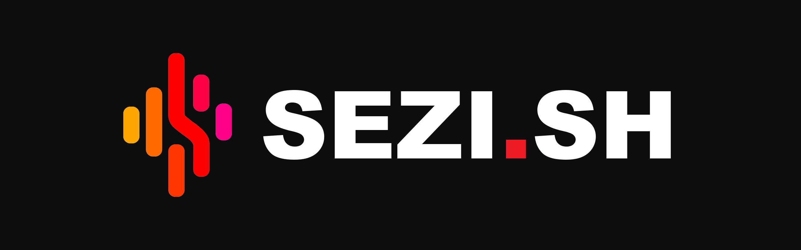

[English](./README.md) · **Русский**

<div align="center">



# sezish

**Речевые инструменты для узбекского рынка. Сначала узбекский и русский.**

**[sezi.sh](https://sezi.sh)**

</div>

*Sezish* по-узбекски значит «восприятие»: от *sezmoq*, ощущать, чувствовать.

Закрытый коммерческий продукт, продаётся в Узбекистане. В этом репозитории живут десктопные версии. Репозиторий приватный; сборки раздаются с `dl.sezi.sh`, никогда через GitHub releases.

## Что умеет

- **Диктовка**: зажал клавишу, сказал, отпустил; текст падает туда, где курсор.
- **Запись встреч** (macOS): системный звук и микрофон, диаризация в две дорожки, транскрипция и AI-резюме.

## Части

| Путь | Что |
|---|---|
| [`app/`](./app) | macOS-приложение в меню-баре: диктовка, встречи, резюме. Референсная реализация |
| [`win/`](./win) | Windows-порт диктовки (Tauri v2 + Rust), ранняя бета |
| [`sezish`](./sezish) | CLI-транскрибатор встреч, один Python-файл |
| [`docs/`](./docs) | ADR и ресёрч |
| [`assets/`](./assets) | Общая графика |

## Сборка

```bash
cd app && make build    # macOS
cd win && cargo build   # Windows
./sezish meeting.mp4    # CLI, сборка не нужна
```

Тестерам сюда: [TESTING.md](./TESTING.md). Агентам сюда: [AGENTS.md](./AGENTS.md).
